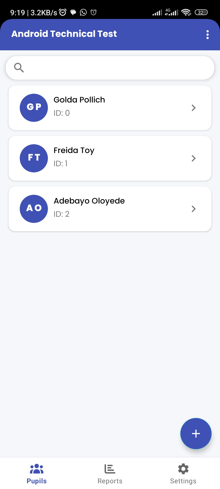
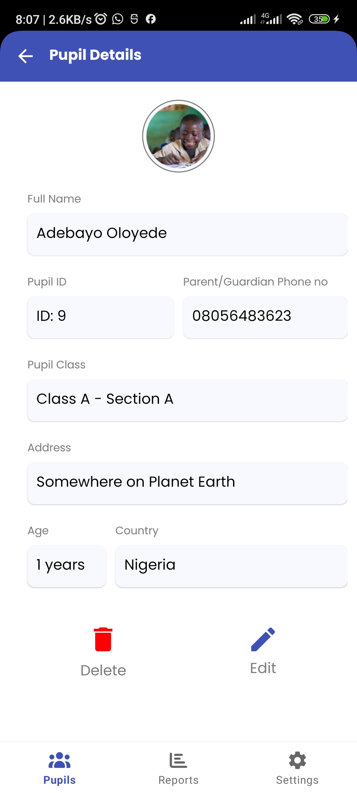
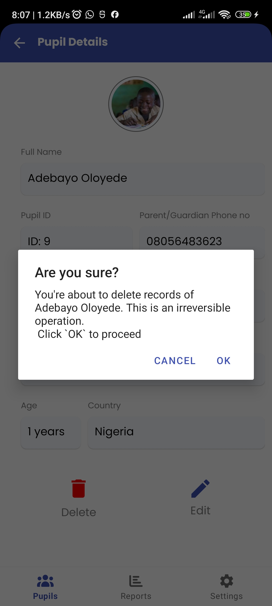
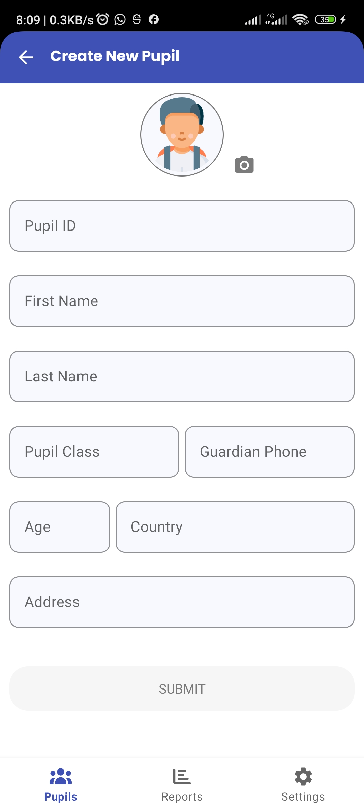
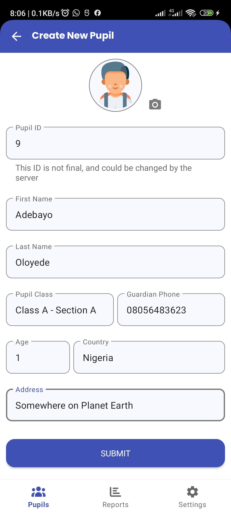
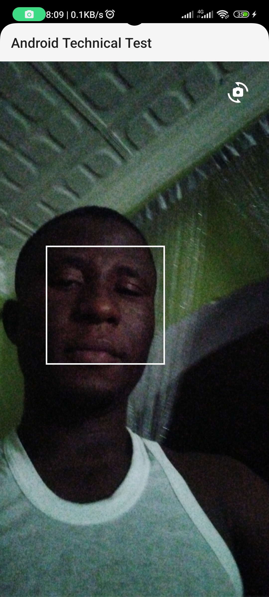
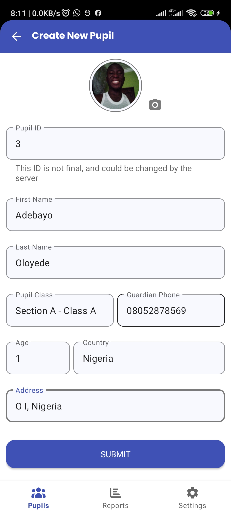
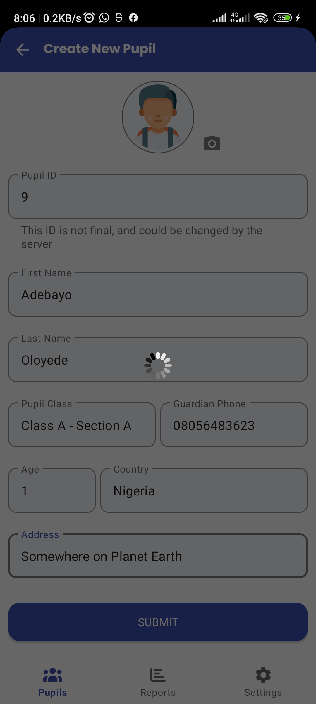

<h1 align="center">Android Technical Test Submission (Adebayo Oloyede)</h1>

  
  
  
   

## Preview

|                                                                |                                                    |                                                               |                                                             |
|----------------------------------------------------------------|----------------------------------------------------|---------------------------------------------------------------|-------------------------------------------------------------|
|                    |     |             |  |
| ----------------------------------------------                 | -------------------------------------              | ----------------------------------------                      | -------------------------------------------------           |
|  |  |  |                 |

## Technologies Used
- [Kotlin](https://kotlinlang.org/), [Coroutines](https://github.com/Kotlin/kotlinx.coroutines) + [Flow](https://kotlin.github.io/kotlinx.coroutines/kotlinx-coroutines-core/kotlinx.coroutines.flow/) to handle all asynchronous network operations and long-running background processes.

- ViewModel - Manages UI-related data-holders to help the UI-components (Fragments and activity) survive configuration changes.

- Navigation Component - Used to handle UI navigations. I made use of single activity architecture with reuseable fragments. Navigation components was used to handle the navigation between the fragments.

- DataBinding - Used to generate binding claesses for XML layouts and also used to bind states to the User interfaces.

- StateFlow and SharedFlow - These are the observable data holder classes used on the application

- Room Database - This was used to handle local caching of the remote data on the application thereby enabling the application to work seamlessly offline.

- DaggerHilt - This is the Dependency injection framework used on the application.

- Paging3 - To handle the lazy loading of data from the server.

- Coil (Coroutine Image Loader) - Used for loading of images on the app.

- [Retrofit2 & OkHttp3]((https://github.com/square/retrofit)) - Used as the REST API clients
- Gson - Used to serialize and deserialize JSON objects
- DSoftCam - This is a camera library developed by my humbleself. It is built untop of [CameraX](https://developer.android.com/media/camera/camerax), [Google Vision]() and [Google MLKit](https://developer.android.com/ai/gemini-nano/ml-kit-genai). This was used to seamlessly handle the capturing of the pupils' profile image.

## App Architecture
This app is built on the MVVM architecture, Clean Architecture and the Repository pattern.

 

